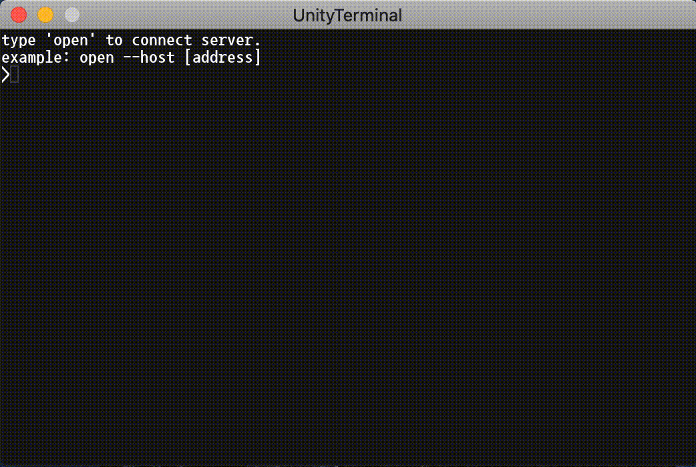
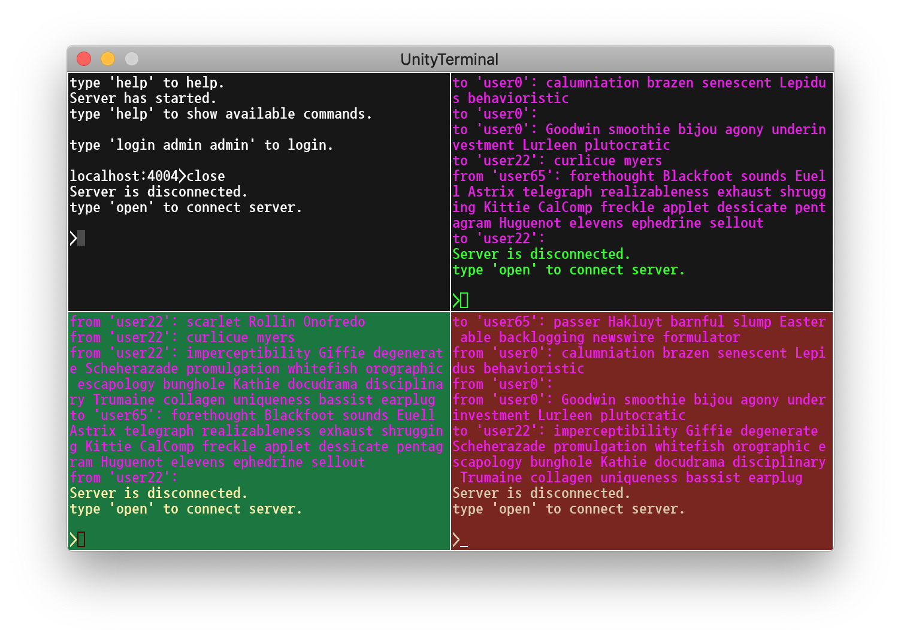
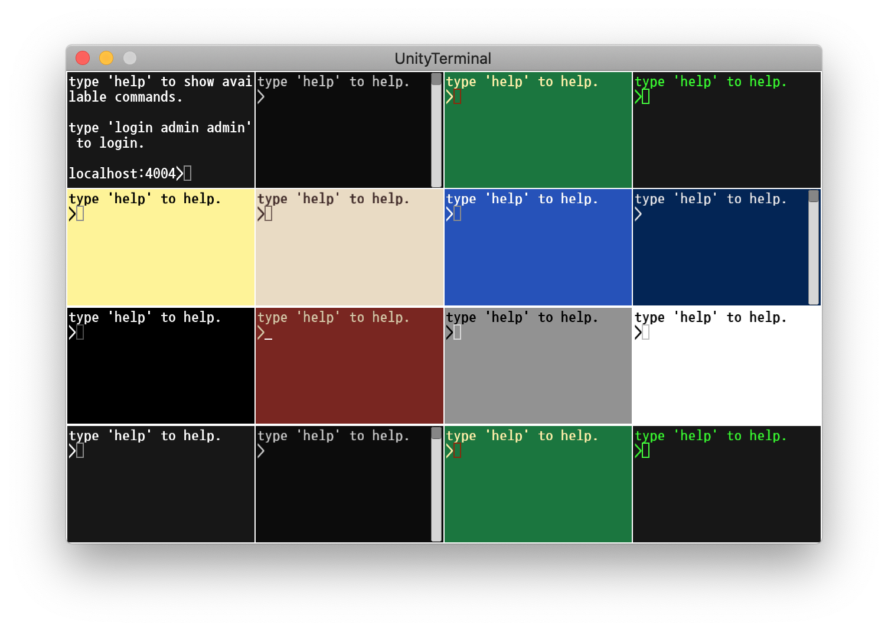
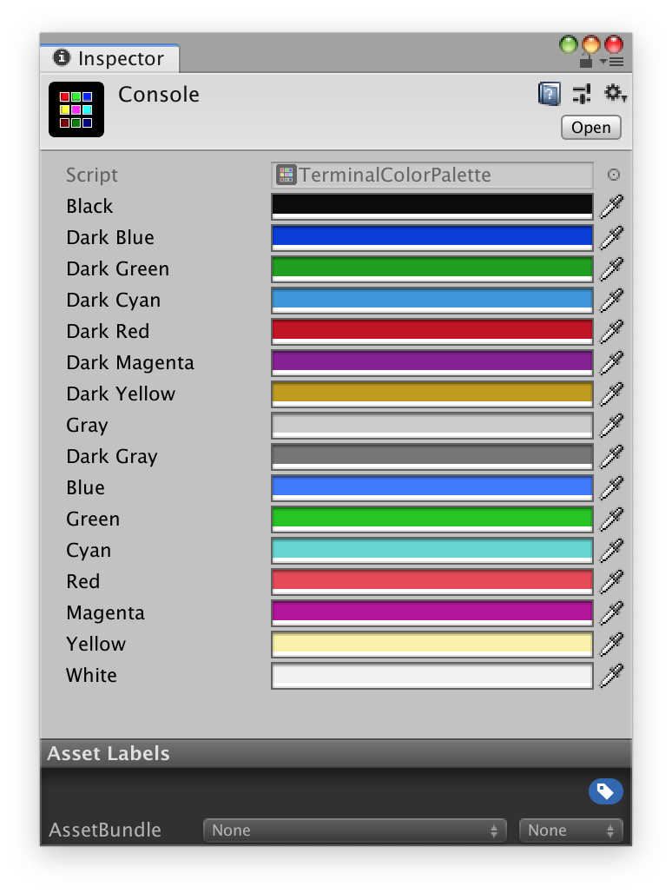
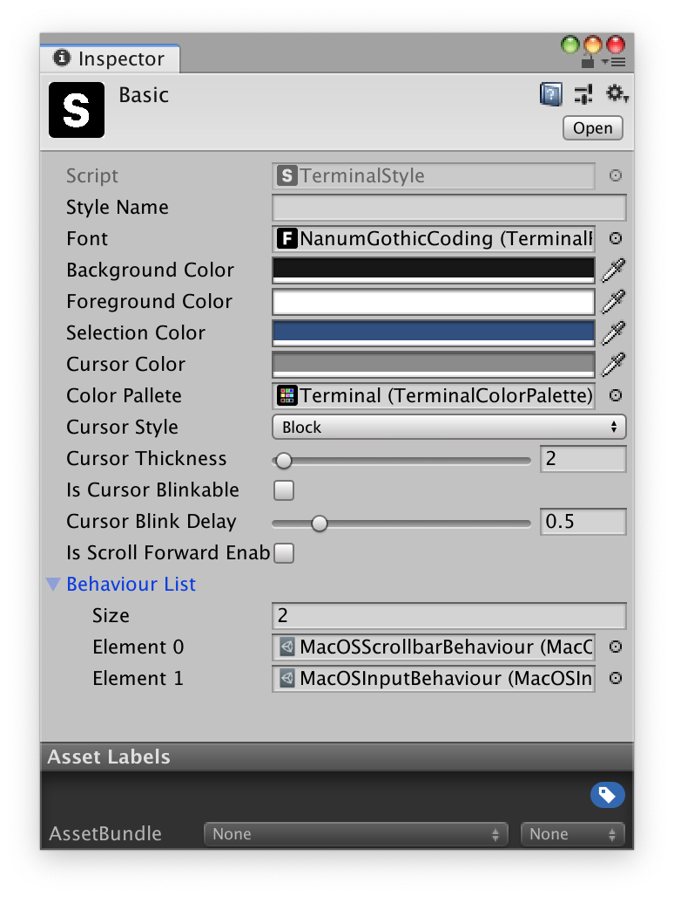

# 특징

유니티에서 터미널 형태의 개발 환경을 구현한 라이브러리입니다.

UGUI로 구현이 되었습니다.

단순한 클래스 정의만으로 명령어를 쉽게 생성할 수 있습니다.

명령어의 실행은 기본적으로 비동기로 실행됩니다.

# 개발 환경

    Unity 2018.4.20f1
    UGUI

# 폴더 구조

## Assets/Plugins/JSSoft.Terminal

    터미널 라이브러리

## Assets/Plugins/JSSoft.Communication.Services

    터미널을 테스트 하기 위한 통신 모듈

# 컴포넌트 구조

## Terminal

    터미널의 동작을 구현한 컴포넌트입니다.
    명령어 실행, 명령어 조합, 명령어내의 커서 위치, 문자열 출력 등 
    시각적 부분을 제외한 핵심 기능이 구현되어 있습니다.

## TerminalGrid

    터미널을 시각적으로 표시하도록 해주는 컴포넌트입니다.
    터미널의 정보를 기반으로 Row와 Cell 기반으로 그리드 형태로 표시됩니다.
    사용자의 상호 동작을 터미널에 전달합니다.

## TerminalBackground

    글자의 배경색을 표시하는 컴포넌트입니다.

## TerminalForeground

    글자와 전경색을 표시하는 컴포넌트입니다.

## TerminalCursor

    명령 프롬프트의 커서를 표시하는 컴포넌트입니다.

## TerminalComposition

    명령 프롬프트에서 IME(input method editor)에 의해 만들어지는 글자를 표시하는 컴포넌트입니다.

## TerminalScrollbar

    스크롤바를 나타냅니다.

## CommandContextHost

    명령어를 제공하여 터미널에서 실행된 명령어를 수행하는 컴포넌트입니다.

## TerminalDispatcher

    CommandContextHost 에 의해서 실행되는 명령은 비동기로 실행됩니다. 
    실행 과정에서 출력해야 할 문자열을 터미널에 출력하기 위해 메인 스레드로 보내기 위한 기능을 수행합니다.

# 팔레트(palette)

    터미널은 16개의 색상을 사용하며 각각의 색상을 다르게 설정할 수 있습니다.

# 행동(behaviour)

    터미널의 종류에 따라 사용자의 상호 동작을 다르게 구현할 수 있습니다.

# 폰트(font)

    https://www.angelcode.com/products/bmfont/ 
    또는 
    https://github.com/s2quake/JSSoft.Font 
    으로 생성된 비트맵 폰트를 사용합니다. 데이터 포맷은 *.fnt 를 사용합니다.

# 스타일(style)

    터미널의 속성을 미리 설정하여 쉽게 터미널의 외형을 변경할 수 있습니다.

# 명령어

## reset

    터미널의 출력된 모든 문자를 삭제합니다.

## exit

    프로그램을 종료합니다.

## verbose

    터미널의 에러/경고 표시의 대한 상세 여부를 설정합니다.

## style

    터미널의 스타일을 변경합니다.