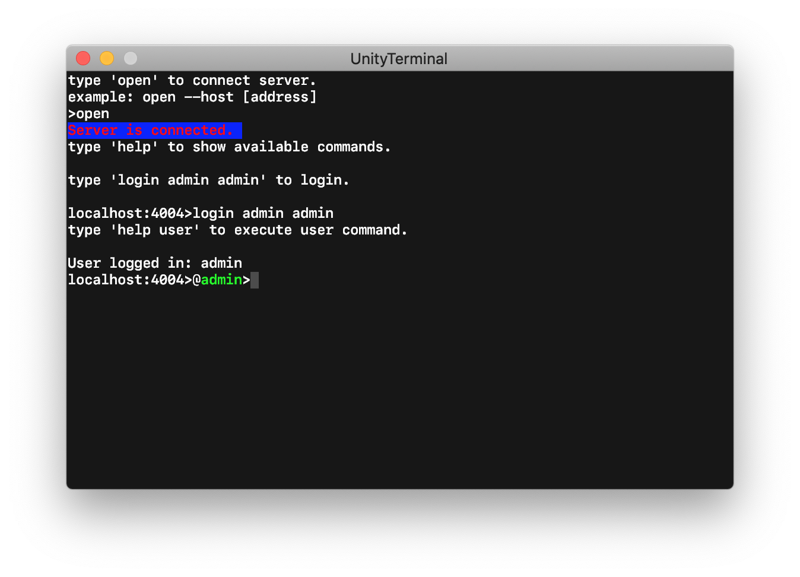

# 개요

터미널을 유니티에서 구현한 프로젝트입니다.

# 실행 방법

프로젝트에는 grpc 기반의 서버 및 클라이언트 라이브러리가 포함되어 있습니다.

따라서 유니티 상에서 예제를 실행하기 위해서는 서버를 실행해야 합니다.

명령창에서 아래 경로에 있는 Server.exe 를 실행합니다.

## Windows

    Assets/Plugins/JSSoft.Communication/Server.exe

## MacOS

    mono Assets/Plugins/JSSoft.Communication/Server.exe

서버가 실행되었으면 Unity에서 Assets/terminal.unity 을(를) 열고 Play 합니다.

