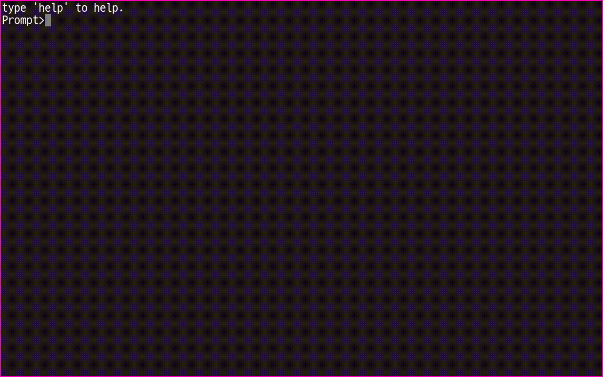

# 소개

일반적인 유닉스 환경에서 사용하는 터미널 프로그램이 아니며

런타임 상에서 사용자의 입력을 받고 처리를 할 수 있는 REPL 환경을 제공하는 라이브러리 입니다.

사용자는 런타임 상에서 특정 필드 및 속성의 값을 변경할 수 있으며

기본적으로 제공되는 명령어를 실행하거나 직접 명령어를 정의하여 사용할 수 있습니다.

# 개발 환경

    Unity 2018.4.27f1

# 만들기

## 터미널

    단순 터미널만 생성합니다. 
    
    이렇게 생성된 터미널은 사용자의 입력을 받을 수는 있지만 아무런 처리를 하지 않습니다.

    GameObject -> UI -> Terminals -> Terminal

## 터미널 + 명령어

    기본적으로 제공되는 명령어를 실행할 수 있으며 사용자가 직접 작성한 명령어를 실행할 수 있습니다.

    명령어의 정의는 https://github.com/s2quake/JSSoft.Library.Commands 에서 확인할 수 있습니다.

    GameObject -> UI -> Terminals -> Terminal - Commands

## 터미널 레이아웃

    터미널을 제외한 터미널이 잘 동작할 수 있는 외형만 생성합니다.

    터미널을 보여지고 사라지게 할 수 있으며 모바일 환경에서는 키보드 보여짐에 따라

    터미널의 크기가 자동으로 조정되는 기능이 포함되어 있습니다.
    
    GameObject -> UI -> Terminals -> TerminalLayout

## 터미널 레이아웃 + 터미널

    터미널의 레이아웃과 단순 터미널을 생성합니다.

    GameObject -> UI -> Terminals -> Terminal Full

### 터미널 레이아웃 + 터미널 + 명령어

    터미널이 잘 동작할 수 있도록 필요한 모든 구성 요소가 함께 생성됩니다.
    
    GameObject -> UI -> Terminals -> Terminal Full - Commands

# 터미널 보이기 / 감추기


    GameObject -> UI -> Terminals -> Terminal Full - Commands 메뉴에서 터미널 생성

    Hierarchy 창에서 Canvas/TerminalRoot 객체 선택

    Inspector 창에서 Terminal Rect Visible Controller 컴포넌트에서 키 값과 방향 값을 설정

    기본 키값은 Control + ` 이며 숨겨지는 방향은 위쪽

    Play 이후 Control + ` 키로 터미널 보이기 또는 감추기

# 터미널에 로그 표시하기

    GameObject -> UI -> Terminals -> Terminal Full - Commands 메뉴에서 터미널 생성

    Hierarchy 창에서 Canvas/TerminalRoot/TerminalLayout/Terminal 객체 선택

    Inspector 창에서 Add Component 클릭후 Terminal Log Receiver 추가

# 명령어 추가하기


## 명령어 만들기

```csharp
using JSSoft.Unity.Terminal;
using JSSoft.Unity.Terminal.Commands;
using UnityEngine.SceneManagement;

public class RestartCommand : TerminalCommandBase
{
    public RestartCommand(ITerminal terminal)
        : base(terminal)
    {
    }

    protected override void OnExecute()
    {
        SceneManager.LoadScene(SceneManager.GetActiveScene().buildIndex);
        this.WriteLine("Scene restarted.");
    }
}
```

    TerminalCommandAsyncBase 을(를) 사용하여 비동기로 명령을 실행할 수 있으며

    TerminalCommandMethodBase 을(를) 사용하여 하위 명령을 정의할 수 있습니다.

## 명령어 제공자 만들기

```csharp
using System.Collections.Generic;
using JSSoft.Library.Commands;
using JSSoft.Unity.Terminal;
using JSSoft.Unity.Terminal.Commands;
using UnityEngine;

[RequireComponent(typeof(CommandContextHost))]
public class CommandSystem : MonoBehaviour, ICommandProvider
{
    private readonly CommandProvider commands = new CommandProvider();

    private void Awake()
    {
        GetComponent<CommandContextHost>().CommandProvider = this;
    }

    #region ICommandProvider

    IEnumerable<ICommand> ICommandProvider.Provide(ITerminal terminal)
    {
        foreach (var item in commands.Provide(terminal))
        {
            yield return item;
        }
        yield return new RestartCommand(terminal);
    }

    #endregion
}
```

### 컴포넌트 추가하기

    GameObject -> UI -> Terminals -> Terminal Full - Commands 메뉴에서 터미널 생성

    Hierarchy 창에서 Canvas/TerminalRoot/TerminalLayout/Terminal 객체 선택

    Inspector 창에서 Add Component 클릭후 Command System 추가

    Play 후 프롬프트창에서 restart 명령어 실행

# 터미널 속성 만들기



## 속성 만들기

```csharp
using System.Collections;
using System.Collections.Generic;
using UnityEngine;
using JSSoft.Unity.Terminal.Commands;

public class TestConfiguration : MonoBehaviour
{
    [SerializeField]
    private float value = 0;
    [SerializeField]
    private ConfigurationSystem configSystem = null;

    private void Awake()
    {
        var config = new FieldConfiguration("test.value", this, nameof(value));
        if (this.configSystem != null)
        {
            this.configSystem.AddConfig(config);
        }
    }
}
```

## 속성 제공자 만들기

```csharp
using System.Collections.Generic;
using JSSoft.Library.Commands;
using JSSoft.Unity.Terminal;
using JSSoft.Unity.Terminal.Commands;
using UnityEngine;

[RequireComponent(typeof(CommandContextHost))]
public class ConfigurationSystem : MonoBehaviour, ICommandConfigurationProvider
{
    private readonly CommandConfigurationProvider configs = new CommandConfigurationProvider();

    private void Awake()
    {
        GetComponent<CommandContextHost>().ConfigurationProvider = this;
    }

    public void AddConfig(ICommandConfiguration provider)
    {
        this.configs.Add(provider);
    }

    #region ICommandConfigurationProvider

    IEnumerable<ICommandConfiguration> ICommandConfigurationProvider.Configs => configs.Configs;

    #endregion
}
```

## 속성 제공자 컴포넌트 추가하기

    GameObject -> UI -> Terminals -> Terminal Full - Commands 메뉴에서 터미널 생성

    Hierarchy 창에서 Canvas/TerminalRoot/TerminalLayout/Terminal 객체 선택

    Inspector 창에서 Add Component 클릭후 Configuration System 추가

## 속성 객체 만들기

    GameObject -> Create Empty로 객체 생성

    Hierarchy 창에서 새로 생성된 GameObject 객체 선택

    Inspector 창에서 Add Component 클릭후 Test Configuration 추가

    Test Configuration 컴포넌트의 Config System 의 값을 Terminal로 선택

## 런타임상에서 속성 사용하기

    Play후 프롬프트에서 config --list 실행하여 config의 값을 확인

    프롬프트에서 config test.value 1 실행하여 값을 1로 변경

    프롬프트에서 config test.value --reset 실행하여 기본값으로 설정
